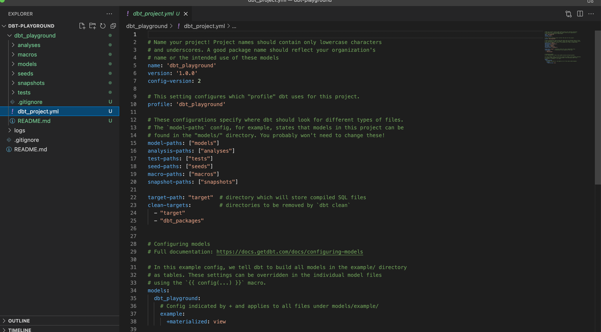
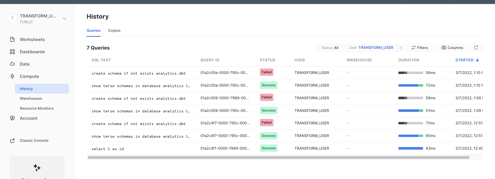
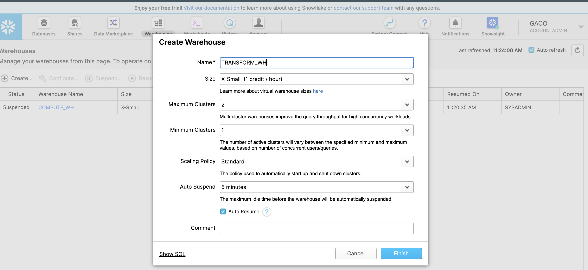
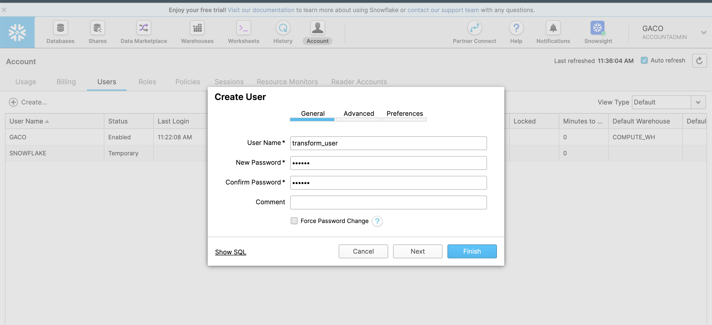
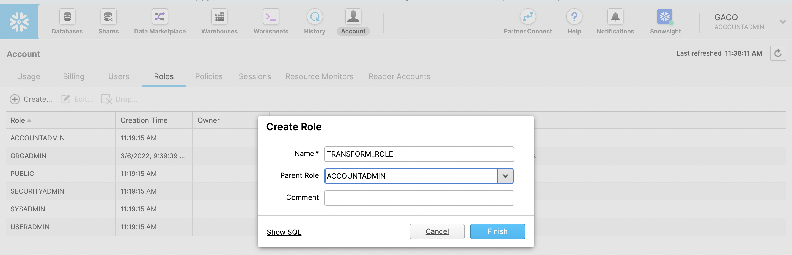
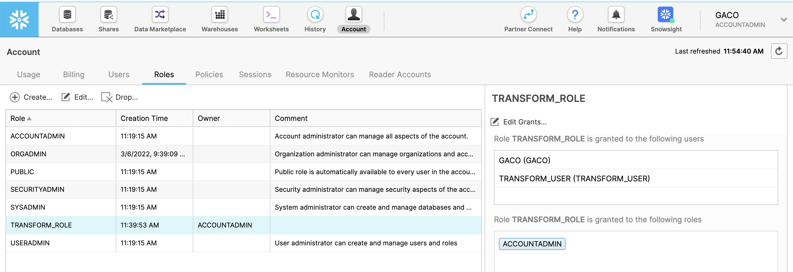

# DBT_PLAYGROUND

- [DBT_PLAYGROUND](#dbt_playground)
  - [Intro](#intro)
  - [DBT Initial Setup](#dbt-initial-setup)
    - [1. Instalallation on MAC](#1-instalallation-on-mac)
    - [2. Create DBT Project](#2-create-dbt-project)
    - [3. Test DBT initial configuration](#3-test-dbt-initial-configuration)
      - [3.1. How to Test Connections](#31-how-to-test-connections)
      - [3.2. How to run/deploy the models](#32-how-to-rundeploy-the-models)
      - [3.3. How to Investigate logs](#33-how-to-investigate-logs)
  - [Snowflake Initial Setup](#snowflake-initial-setup)
    - [1. Create new Data Warehouse](#1-create-new-data-warehouse)
    - [2. Create user to perform the transformations](#2-create-user-to-perform-the-transformations)
    - [3. Create role and grant access](#3-create-role-and-grant-access)
    - [4. Create database and grant priveleges](#4-create-database-and-grant-priveleges)
  - [DBT Cloud](#dbt-cloud)
    - [Types of materialization](#types-of-materialization)
    - [Project Structure](#project-structure)
    - [Cloud Development](#cloud-development)
    - [Run job on Prod](#run-job-on-prod)
      - [On Demand Job](#on-demand-job)
      - [CI/CD](#cicd)

---

## Intro

- The purpose of this project is to learn DBT.
- To do that, I createad a trial account in Snowflake and looked for data to play around.
   - I used data from:
     -  SNOWFLAKE_SAMPLE_DATA database - from Snowflake's sample database.
        - models for this data are defined in models/example
     -  AGRICULTURE_DATA_ATLAS database - from SNowflake's market place.
        - models for this data are defined in models/staging and and models/metrics
        - it fetches monthly _meat_ and _rice_ prices changes over the year into staging area and then, generates two simple fact tables.
- I also created a trial account in DBT Cloud to be create jobs and play around there.

## DBT Initial Setup

### 1. Instalallation on MAC

```shell
brew update
brew install git
brew tap dbt-labs/dbt
brew install dbt-snowflake
```

### 2. Create DBT Project

- Initalize your dbt project like below:

`dbt init <project_name>`.  

> In our case: dbt init dbt_playground 

- And fill the required information as requested. It will create a `profiles.yml` with the informations required so that DBT is able to connect to Snowflake and perform its transformation:

```yaml
gabriel@Gabriels-Air dbt-playground % dbt init dbt-playground
14:34:10  Running with dbt=1.0.3
dbt-playground is not a valid project name.
Enter a name for your project (letters, digits, underscore): dbt_playground
Which database would you like to use?
[1] snowflake

(Don't see the one you want? https://docs.getdbt.com/docs/available-adapters)

Enter a number: 1
account (https://<this_value>.snowflakecomputing.com): hz85786.us-east-2.aws
user (dev username): transform_user
[1] password
[2] keypair
[3] sso
Desired authentication type option (enter a number): 1
password (dev password): 
role (dev role): transform_role
warehouse (warehouse name): transform_wh
database (default database that dbt will build objects in): analytics
schema (default schema that dbt will build objects in): dbt_gabriel
threads (1 or more) [1]: 
14:59:11  Profile dbt_playground written to /Users/gabriel/.dbt/profiles.yml using target's profile_template.yml and your supplied values. Run 'dbt debug' to validate the connection.
14:59:11  
Your new dbt project "dbt_playground" was created!

For more information on how to configure the profiles.yml file,
please consult the dbt documentation here:

  https://docs.getdbt.com/docs/configure-your-profile

One more thing:

Need help? Don't hesitate to reach out to us via GitHub issues or on Slack:

  https://community.getdbt.com/

Happy modeling!

gabriel@Gabriels-Air dbt-playground % 

```

- Your profile should be something like this:

```yaml
gabriel@Gabriels-Air dbt-playground % cat /Users/gabriel/.dbt/profiles.yml
dbt_playground:
  outputs:
    dev:
      account: hz85786.us-east-2.aws
      database: analytics
      password: ********
      role: transform_role
      schema: dbt_gabriel
      threads: 1
      type: snowflake
      user: transform_user
      warehouse: transform_wh
  target: dev
```

> According to DBT best practices, schema should be: dbt_<username>

- And a new directory called dbt-playground should have a structure like below:




### 3. Test DBT initial configuration

#### 3.1. How to Test Connections

- Run `dbt debug` to check if dbt is able to connect to the database:

```yaml
gabriel@Gabriels-Air dbt_playground % dbt debug
15:45:34  Running with dbt=1.0.3
dbt version: 1.0.3
python version: 3.9.10
python path: /opt/homebrew/Cellar/dbt-snowflake/1.0.0_2/libexec/bin/python3.9
os info: macOS-12.2.1-arm64-arm-64bit
Using profiles.yml file at /Users/gabriel/.dbt/profiles.yml
Using dbt_project.yml file at /Users/gabriel/dev/meus/dbt-playground/dbt_playground/dbt_project.yml

Configuration:
  profiles.yml file [OK found and valid]
  dbt_project.yml file [OK found and valid]

Required dependencies:
 - git [OK found]

Connection:
  account: hz85786.us-east-2.aws
  user: transform_user
  database: analytics
  schema: dbt
  warehouse: transform_wh
  role: transform_role
  client_session_keep_alive: False
  Connection test: [OK connection ok]

All checks passed!
gabriel@Gabriels-Air dbt_playground % 
```

#### 3.2. How to run/deploy the models

- Run `dbt run`to run SQLs against our Snowflake database:

> **dbt run** executes compiled sql model files against the current `target` database. dbt connects to the target database and runs the relevant SQL required to materialize all data models using the specified materialization strategies.
>
> Reference: https://docs.getdbt.com/reference/commands/run

   ```python
   gabriel@Gabriels-Air dbt_playground % dbt run       
   16:10:50  Running with dbt=1.0.3
   16:10:50  Found 2 models, 4 tests, 0 snapshots, 0 analyses, 179 macros, 0 operations, 0 seed files, 0 sources, 0 exposures, 0 metrics
   16:10:50  
   16:10:55  Encountered an error:
   Database Error
     003041 (42710): SQL compilation error:
     Schema 'DBT' already exists, but current role has no privileges on it. If this is unexpected and you cannot resolve this problem, contact your system administrator. ACCOUNTADMIN role may be required to manage the privileges on the object.
   gabriel@Gabriels-Air dbt_playground % 
   ```

- We can see that it failed due to grant previleges.

#### 3.3. How to Investigate logs

- To check the SQL statements that were executed. We can see the logs in `logs/dbt.log`:

  

  

  - We can see the query executed on line 19 that ended sucessfuly (see line 22) as well as the create schema statement on line 28 that failed with the snowflake query id shown on line 31. We can see this query id on snowflake as well:



- Fix that by granting the needed permissions and try again:

```sql
-- DDL grants
grant create schema on database analytics to role transform_role;
-- Usage grants
grant usage on all schemas in database analytics to role transform_role;
grant usage on future schemas in database analytics to role transform_role;
grant usage on warehouse transform_wh to role transform_role;
grant usage on database analytics to role transform_role;
-- Query grants
grant select on all tables in database analytics to role transform_role;
grant select on future tables in database analytics to role transform_role;
grant select on all views in database analytics to role transform_role;
grant select on future views in database analytics to role transform_role;
```

```python
gabriel@Gabriels-Air dbt_playground % dbt run 
16:58:31  Running with dbt=1.0.3
16:58:31  Found 2 models, 4 tests, 0 snapshots, 0 analyses, 179 macros, 0 operations, 0 seed files, 0 sources, 0 exposures, 0 metrics
16:58:31  
16:58:36  Concurrency: 1 threads (target='dev')
16:58:36  
16:58:36  1 of 2 START table model dbt.my_first_dbt_model................................. [RUN]
16:58:40  1 of 2 OK created table model dbt.my_first_dbt_model............................ [SUCCESS 1 in 3.30s]
16:58:40  2 of 2 START view model dbt.my_second_dbt_model................................. [RUN]
16:58:42  2 of 2 OK created view model dbt.my_second_dbt_model............................ [SUCCESS 1 in 2.22s]
16:58:42  
16:58:42  Finished running 1 table model, 1 view model in 11.26s.
16:58:42  
16:58:42  Completed successfully
16:58:42  
16:58:42  Done. PASS=2 WARN=0 ERROR=0 SKIP=0 TOTAL=2
gabriel@Gabriels-Air dbt_playground % 

```

- We should be able to see two models in snowflake created by DBT. One table and one view:


## Snowflake Initial Setup

### 1. Create new Data Warehouse



Create Snowflake table:

```sql
CREATE WAREHOUSE TRANSFORM_WH WITH WAREHOUSE_SIZE = 'XSMALL' WAREHOUSE_TYPE = 'STANDARD' AUTO_SUSPEND = 300 AUTO_RESUME = TRUE MIN_CLUSTER_COUNT = 1 MAX_CLUSTER_COUNT = 2 SCALING_POLICY = 'STANDARD';
```

change auto_suspend to 60s.

```sql
ALTER WAREHOUSE "TRANSFORM_WH" SET WAREHOUSE_SIZE = 'XSMALL' AUTO_SUSPEND = 60 AUTO_RESUME = TRUE MIN_CLUSTER_COUNT = 1 MAX_CLUSTER_COUNT = 2 SCALING_POLICY = 'STANDARD' COMMENT = '';
```

### 2. Create user to perform the transformations



### 3. Create role and grant access

- **transform_role**: this role will be used by transform_user, which will be used by DBT.



And grant access to the previous created user (as well for ourselves) to this new role:

	

   - **analytics**: this role is to be conceded to analytics users in general:


### 4. Create database and grant priveleges

1. Create **Analytics** database:


2. Grant privileges to role:
   - **transform_role**: this role will be used by transform_user, which will be used by DBT:
   
     ```sql
     -- DDL grants
     grant create schema on database analytics to role transform_role;
     -- Usage grants
     grant usage on all schemas in database analytics to role transform_role;
     grant usage on future schemas in database analytics to role transform_role;
     grant usage on warehouse transform_wh to role transform_role;
     grant usage on database analytics to role transform_role;
     -- Query grants
     grant select on all tables in database analytics to role transform_role;
     grant select on future tables in database analytics to role transform_role;
     grant select on all views in database analytics to role transform_role;
     grant select on future views in database analytics to role transform_role;
     ```
   
     
   
   - **analytics**: this role is to be conceded to analytics users in general:
   
     ```sql
     grant usage on warehouse compute_wh to role analyst;
     grant usage on database analytics to role analyst;
     ```


## DBT Cloud


### Types of materialization


| #               | VIEW                                                         | TABLE                                                        | INCREMENTAL                                                  | EPHMERAL                                                     |
| --------------- | ------------------------------------------------------------ | ------------------------------------------------------------ | ------------------------------------------------------------ | ------------------------------------------------------------ |
| **Description** | When using the `view` materialization, your model is rebuilt as a view on each run, via a `create view as` statement. | When using the `table` materialization, your model is rebuilt as a table on each run, via a `create table as` statement. | `incremental` models allow dbt to insert or update records into a table since the last time that dbt was run. | `ephemeral` models are not directly built into the database. Instead, dbt will interpolate the code from this model into dependent models as a common table expression. |
| **Pros**        | No additional data is stored, views on top of source data will always have the latest records in them. | Tables are fast to query                                     | You can significantly reduce the build time by just transforming new records. | You can still write reusable logic.<br /><br />Ephemeral models can help keep your data warehouse clean by reducing clutter (also consider splitting your models across multiple schemas by [using custom schemas](https://docs.getdbt.com/docs/building-a-dbt-project/building-models/using-custom-schemas)). |
| **Cons**        | Views that perform significant transformation, or are stacked on top of other views, are slow to query. | Tables can take a long time to rebuild, especially for complex transformations.<br /><br />New records in underlying source data are not automatically added to the table. | Incremental models require extra configuration and are an advanced usage of dbt.  Read more about using incremental models [here](https://docs.getdbt.com/docs/building-a-dbt-project/building-models/configuring-incremental-models). | You cannot select directly from this model.<br />Operations (e.g. macros called via `dbt run-operation` cannot `ref()` ephemeral nodes)<br /><br />Overuse of the ephemeral materialization can also make queries harder to debug. |
| **Advice**      | Generally start with views for your models, and only change to another materialization when you're noticing performance problems. <br /><br />Views are best suited for models that do not do significant transformation, e.g. renaming, recasting columns. | Use the table materialization for any models being queried by BI tools, to give your end user a faster experience.<br /><br />Also use the table materialization for any slower transformations that are used by many downstream models. | Incremental models are best for event-style data.<br /><br />Use incremental models when your `dbt run`s are becoming too slow (i.e. don't start with incremental models). | Use the ephemeral materialization for:  <br /><br />    - very light-weight transformations that are early on in your DAG;<br />    - when only used in one or two downstream models;<br /><br />    - when do not need to be queried directly. |


### Project Structure

- This project has two staging entities and two aggregations that will be created from those two entities.
- It also has a bunch of examples models that I did when learning


### Cloud Development

- it is possible to develop on the dbt cloud:


### Run job on Prod

- Create a prod environment


#### On Demand Job

1. Create a new job:

- just for fun with **tags**, lets run only meat model


2. Run the job:


3. See Results:


#### CI/CD

1. Create a new job and set webhook:

   

2. Do some pull request:

   

3. See the magic happen, as the build starts automatically:


